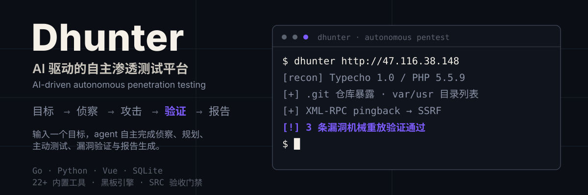
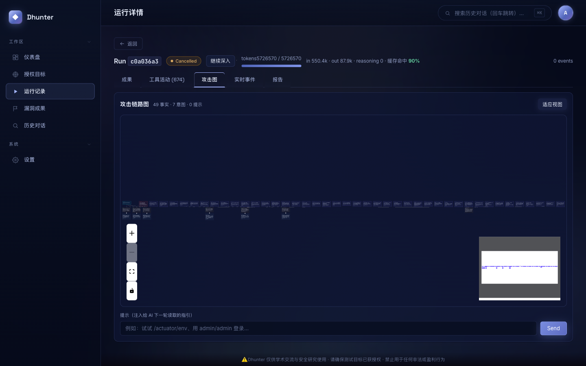
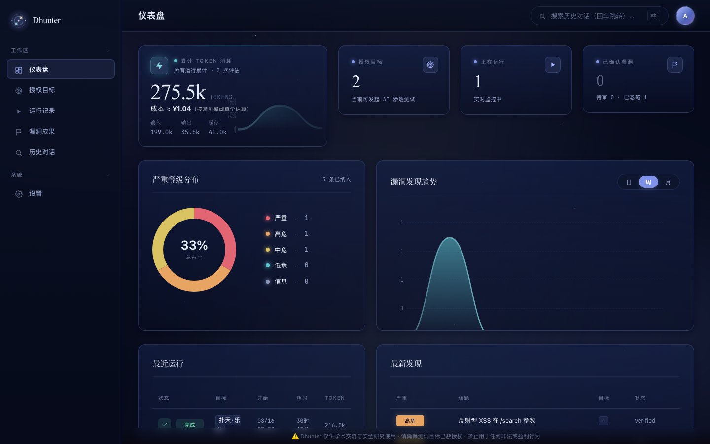
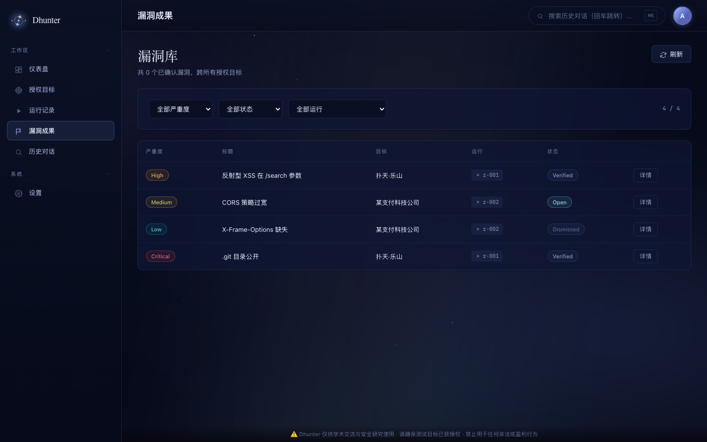
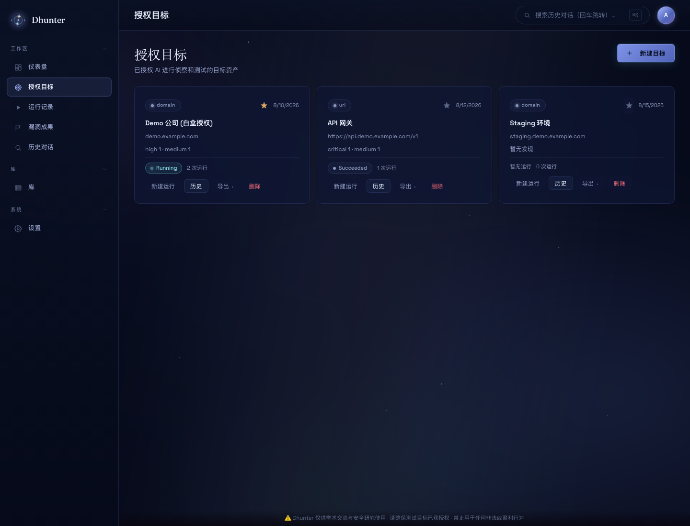
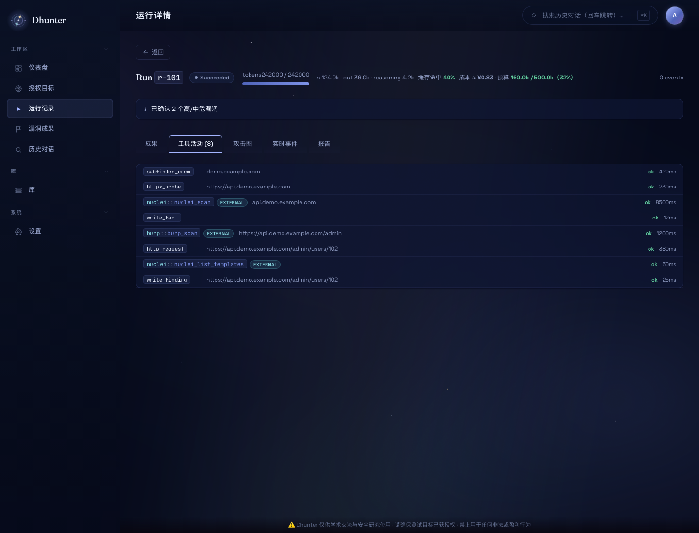
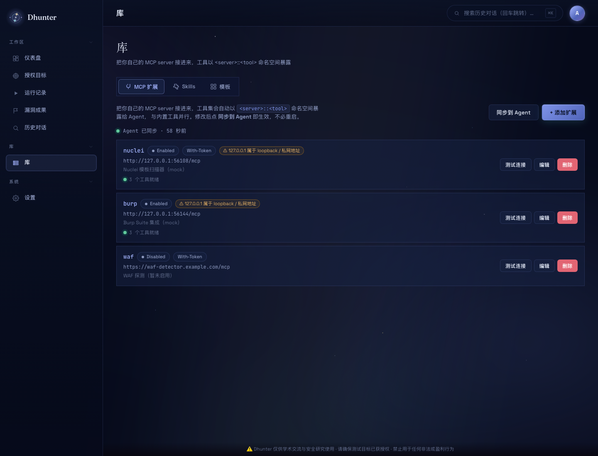
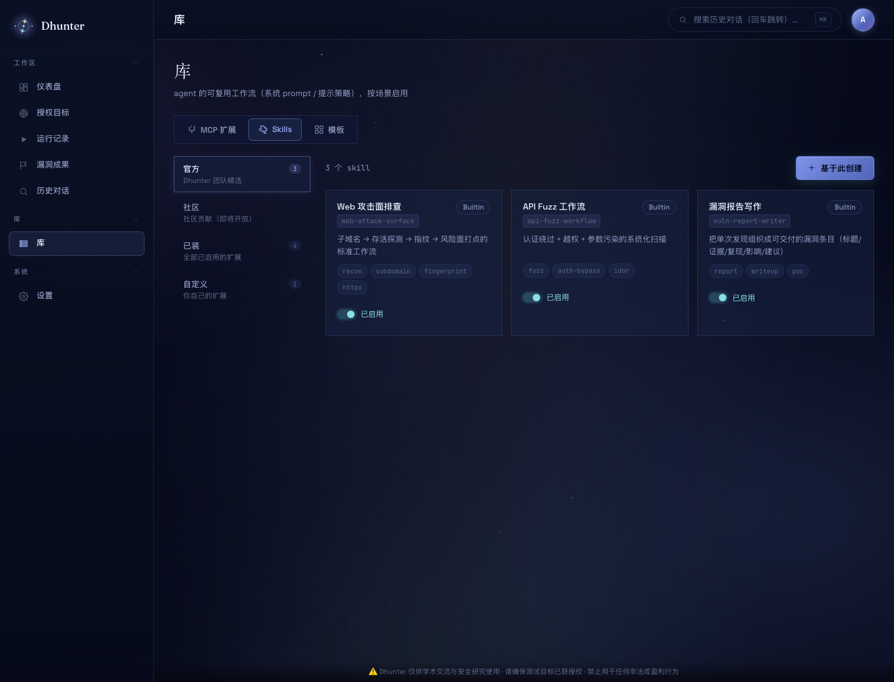
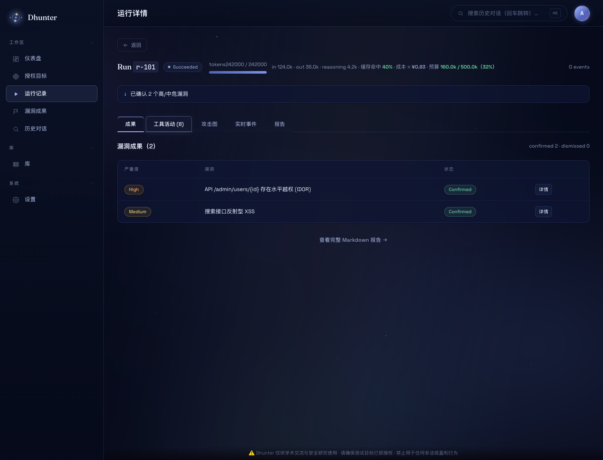
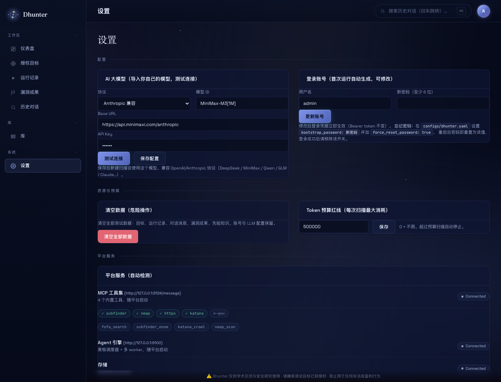

<p align="center">
  
</p>

> ⚠️ **仅供学术交流与安全研究使用 · 禁止用于任何非法或盈利行为。**
> 请确保所有测试目标均已获得授权。

---

## 它不是漏扫，而是一个"手动化"的渗透测试 agent

传统漏扫器只会跑 CVE 指纹和已知 payload。Dhunter 让一个（未来多个）**LLM agent** 驱动一套精选工具，像真人渗透测试员那样思考与行动：

- 先做**侦察**（子域 / JS / 指纹 / 历史 URL），把攻击面摸清；
- 再**规划**攻击意图，一个黑板（blackboard）协调多个 worker **并行探索**；
- 每个结论都要**先验证再上报**——SRC 验收门禁会机械重放你的 PoC，时变噪声会被自动驳回；
- 最终把确认的漏洞汇总成一份 **Markdown 报告**。

## 📸 真实效果

下面这张攻击链图来自一次真实的授权测试（Typecho 博客靶场）：agent 自主构建了 49 条事实、7 个攻击意图，把 `.git` 暴露、XML-RPC SSRF、install.php 等发现串成完整的攻击链。

<p align="center">
  
  <em>攻击链图：agent 自主构建的事实 → 意图 → 发现网络，实时可视化</em>
</p>

平台主界面与核心功能：

<p align="center">
  
  
</p>

<p align="center">
  
  
</p>

<p align="center">
  
  
</p>

<p align="center">
  
  
</p>

## ✨ v0.7.1 新增（库 / MCP 扩展中心 / External 工具）

> 新增一级菜单 **库**（侧栏中部），里面分三个 tab：

**MCP 扩展** — 把你自己的 MCP server 接进来。工具以 `<server>::<tool>` 命名空间暴露给 Agent，与内置 22 个工具并行。修改后点「同步到 Agent」即时生效，不必重启。

托管型 Streamable HTTP MCP 的鉴权 Header 和 Scheme 可分别配置；默认仍为
`Authorization: Bearer <token>`，将 Scheme 留空则直接发送 Token。客户端会自动保存
`initialize` 响应中的 `Mcp-Session-Id` 并在后续请求中透传。例如接入 Quake MCP 时可填：

```text
URL:         https://quake.360.net/mcp/
Auth Header: X-QuakeToken
Auth Scheme: （留空）
Token:       <Quake API Token>
```

- 每行显示「● Agent 已同步 · 58 秒前」+ per-row 状态指示（绿/红/灰点 + 工具数）
- 私网 / loopback / 云元数据 URL 自动加 ⚠ 黄色提示（不阻断，本地 MCP 合法）
- Token 仅在 Create 响应中明文返回一次
- 工具数量上限保护（单 server 100，整个 external 池 300）

**Skills** — agent 的可复用工作流（系统 prompt / 提示策略），按场景启用。3 个内置技能种子（Web 攻击面排查 / API Fuzz 工作流 / 漏洞报告写作），可基于此创建自定义副本。

**模板** — 行业场景包（OWASP Top 10、API Fuzz 入门、JS 深度审计），一键导入。

RunDetail 工具活动面板：命名空间工具自动加 `EXTERNAL` 标签，与内置工具一眼区分。

## ✨ 核心特性

| 特性 | 说明 |
|---|---|
| 🧠 **黑板引擎** | facts/intents/hints 持久化到 SQLite，planner 提出意图 → 多 worker 并行探索 → 收敛，纯 stigmergy 协调 |
| 🔍 **手动化侦察** | 子域枚举、JS 资产与凭据分析、历史 URL、技术指纹，20+ 内置工具随平台启动 |
| ⚔️ **主动测试** | HTTP 手工探测、参数 fuzz、认证绕过、信息泄露路径、业务逻辑测试，agent 自主选工具 |
| 🛡️ **SRC 验收门禁** | verifier 对每条漏洞做**机械重放 + 稳定性检查**：同一 PoC 两次结果不一致 = 时变噪声 → 自动驳回，杜绝误报 |
| 🎯 **漏洞优先验证** | worker 每落地一条漏洞立即触发 verifier 机械重放验证，不用等扫描结束 |
| 🔌 **MCP 扩展中心** | 把你自己的 MCP server 接进来，工具以 `<server>::<tool>` 命名空间暴露，UI 一键增删测 + 同步到 agent |
| 🧰 **库 / Skills / 模板** | 一级菜单「库」聚合 MCP / Skills / 模板三类可复用资产，3 个内置 skill 种子可基于此创建自定义副本 |
| 🧵 **每项目并发设置** | 创建目标时可指定并发 worker 数，深挖大目标时加大并发、小目标降速省 token |
| ⏸️ **运行暂停/恢复** | 随时暂停 run（保留已发现的黑板），之后一键「继续」从断点恢复 |
| 📦 **项目一键导出** | 目标卡上「导出报告」一键打包该项目全部漏洞为 Markdown（含 PoC/复现/证据） |
| ⚡ **实时思考流** | SSE 实时推送 agent 的思考、工具调用、工具结果，整个过程透明可见；命名空间工具带 EXTERNAL 标签 |
| 📄 **一键报告** | 每次运行导出 Markdown 报告（v0.6.0 起 PoC 块带 verifier 机械复现记录 + curl 复现命令） |
| 🔐 **首启自动账号** | 首次运行自动生成管理账号（用户名 + 随机密码），横幅展示，之后可在设置页修改 |
| 💻 **跨平台** | macOS / Linux / Windows 三平台启动脚本，Go 纯静态二进制（无 CGO） |

## 🚀 快速开始

### 环境要求

| 依赖 | 版本 | 用途 |
|---|---|---|
| **Go** | 1.22+ | server + MCP 工具集（纯 Go 无 CGO，单静态二进制） |
| **Python** | 3.10+ | agent（黑板调度器） |
| **Node.js** | 18+ | **可选** — 仓库已带预构建 dist，无 Node 也能直接启动；改前端源码后需要重 build |
| 外部扫描器 | 可选 | 见 [外部工具依赖](#-外部工具依赖可选)，缺失自动跳过 |

### 一键启动（推荐）

```bash
# 先装外部扫描器（可选，缺失会自动跳过）
./scripts/setup-tools.sh                                   # macOS / Linux
powershell -ExecutionPolicy Bypass -File scripts\setup-tools.ps1   # Windows

# 启动三件套
./scripts/start-dhunter.sh start                           # macOS / Linux
powershell -ExecutionPolicy Bypass -File scripts\start-dhunter.ps1 start   # Windows
```

启动后打开 <http://127.0.0.1:13343/>。

**首次运行的登录账号会自动生成**，在启动横幅（终端 / 日志）中可见：

```
╔════════════════════════════════════════════════════════╗
║                       Dhunter                          ║
╚════════════════════════════════════════════════════════╝
  ONLINE  http://127.0.0.1:13343/
  ADMIN SETUP REQUIRED
    username: admin
    password: <随机生成，仅显示一次>
    token:    <随机生成>
```

登录后可在**设置 → 登录账号**里修改用户名和密码。之后每次重启登录凭据保持不变。

### 使用流程（用户视角）

1. **授权目标** → 新建目标：填目标（公司/域名/URL/IP）、目标说明、可选身份会话与红线，按需设置**并发 worker 数**
2. **启动评估** → 平台自动跑：planner 规划攻击意图 → 多 worker 并行探索 → **每落地一条漏洞立即机械重放验证**
3. **实时跟踪** → 运行详情页看 agent 思考流、工具调用、攻击图；扫到一半可 **⏸ 暂停**，之后 **▶ 继续**
4. **导出报告** → 目标卡「导出报告」一键打包该项目全部漏洞（Markdown，含 PoC/复现/证据）；运行详情也有单次 Markdown 报告

### 手动启动（从源码）

```bash
# 0. （推荐）一次性生成并导出三进程一致的 token（agent 复用平台 token）
source scripts/dev-env.sh

# 1. 构建前端（仓库已带预构建 dist，无需 Node 即可启动；改过前端源码才需要重 build）
cd frontend && npm install && npm run build && cd ..

# 2. 构建 Go 平台（server + MCP 工具）
go build -o bin/dhunter-server ./cmd/dhunter-server
go build -o bin/dhunter-mcp    ./cmd/dhunter-mcp

# 3. 启动 Python agent（黑板引擎；token 与平台一致，三进程一个标准）
cd agents
pip install -r requirements.txt
python -m core.server          # 127.0.0.1:9100
cd ..

# 4. 启动 server（自动 serve 前端 dist）
./bin/dhunter-server --config configs/dhunter.yaml   # 127.0.0.1:13343
# admin token 未配置时会自动生成随机值并持久化（横幅/日志可见）；可用
# DHUNTER_ADMIN_TOKEN 显式指定

# 5. （可选）外部扫描器
./scripts/setup-tools.sh
```

> 不用 `dev-env.sh` 也可以：只要保证 Python agent 的 `DHUNTER_AGENT_TOKEN`
> 与 Go server 的 `DHUNTER_AGENT_TOKEN` 一致（推荐都用平台 admin token），
> MCP 用独立 token 并同时传给 `dhunter-mcp -t` 与 `DHUNTER_MCP_TOKEN`。

## 🧰 外部工具依赖（可选）

Dhunter **核心服务零外部依赖**（Go 单二进制 + 进程内 HTTP）。外部扫描器是**可选的**——未安装时平台会**自动跳过并提示改用替代方法**（graceful degradation），不影响核心漏洞挖掘。

一键安装全部扫描器：

```bash
# macOS / Linux
./scripts/setup-tools.sh

# Windows
powershell -ExecutionPolicy Bypass -File scripts\setup-tools.ps1
```

安装后二进制落在 `tools/bin/`，启动脚本自动加入 PATH。也可手动安装：

| 工具 | 用途 | macOS | Windows |
|---|---|---|---|
| `httpx` | 存活 / 指纹 / 技术识别 | `go install github.com/projectdiscovery/httpx/cmd/httpx@latest` | 同左（装 Go 后） |
| `subfinder` | 被动子域枚举 | `go install github.com/projectdiscovery/subfinder/v2/cmd/subfinder@latest` | 同左 |
| `katana` | 全站爬虫 | `go install github.com/projectdiscovery/katana/cmd/katana@latest` | 同左 |
| `gau` | 历史 URL | `go install github.com/lc/gau/v2/cmd/gau@latest` | 同左 |
| `waybackurls` | Wayback URL | `go install github.com/tomnomnom/waybackurls@latest` | 同左 |
| `assetfinder` | 子域发现 | `go install github.com/tomnomnom/assetfinder@latest` | 同左 |
| `nmap` | 端口扫描 | `brew install nmap` | [官方安装包](https://nmap.org/download.html) |
| `arjun` / `uro` | 参数 fuzz / URL 去重 | `pip3 install arjun uro` | `pip install arjun uro` |

> 缺少某个扫描器不会报错——agent 会收到"[工具 xxx 未安装] 已跳过，可改用替代方法"的提示并自动换工具。

### 配置 LLM

Dhunter 兼容 Anthropic / OpenAI 协议（DeepSeek / MiniMax / Qwen / GLM / Claude…）。在**设置页**填入模型、Base URL、API Key 并测试连接，或在 `configs/dhunter.yaml` 配置：

```yaml
llm:
  provider: anthropic
  model: "deepseek-chat"
  base_url: "https://api.deepseek.com/anthropic"
  api_key: "sk-..."
```

## 🏗 架构

```
┌────────────────┐     ┌────────────────┐     ┌─────────────────┐
│  Vue 3 Web UI  │ ←─→ │ Go HTTP + SSE  │ ←─→ │ Python Agent    │
│  (Vite build)  │     │  (Gin)         │     │ (黑板 + worker) │
└────────────────┘     └────────────────┘     └────────┬────────┘
                              │                        │
                              ↓                        ↓
                       ┌────────────┐         ┌──────────────┐
                       │  SQLite    │         │  MCP 工具集  │
                       │ targets /  │         │  侦察 / 指纹  │
                       │ runs /     │         │  主动测试     │
                       │ vulns /    │         │  报告         │
                       └────────────┘         └──────────────┘
```

**运行流程**：`origin/goal 事实` 种入黑板 → planner（reason）提出攻击意图 → 多 worker 并行探索并回写事实 → 收敛 → verifier 对每条漏洞做机械重放验收 → 生成报告。worker 之间不直接通信，全靠黑板协调（stigmergy）。

## ⚙️ 配置

| Key | 默认值 | 说明 |
|---|---|---|
| `server.port` | `13343` | HTTP 端口 |
| `agent.python_url` | `http://127.0.0.1:9100` | Python agent |
| `agent.token` | 空 | 发给 Python agent 的 Bearer token（须与 agent 的 `DHUNTER_AGENT_TOKEN` 一致；留空=agent 无鉴权，仅本地开发） |
| `mcp.webhunter.url` | `http://127.0.0.1:9124/message` | MCP 工具端点 |
| `mcp.webhunter.token` | 空 | dhunter-mcp 的 Bearer token（设置页探测工具列表用；可由 `DHUNTER_MCP_TOKEN` 覆盖） |
| `llm.provider` | `anthropic` | `anthropic` / `openai` |
| `storage.sqlite_path` | `../data/dhunter.db` | 相对配置文件解析，跨平台 |
| `admin.username` | `admin` | 登录用户名（首启可改） |
| `admin.bootstrap_password` | 空 | 首次启动初始密码；留空则随机生成。改密码请用设置页 |
| `admin.token` | 空（自动生成） | 平台 admin Bearer token；**留空时首次启动自动生成随机值并持久化**（重启不变，横幅展示），不再有静态默认值 |

环境变量：`DHUNTER_PORT` / `DHUNTER_SQLITE_PATH` / `DHUNTER_LLM_API_KEY` /
`DHUNTER_ADMIN_TOKEN` / `DHUNTER_AGENT_TOKEN` / `DHUNTER_MCP_TOKEN` 等均可覆盖 YAML。

> 🔐 **三进程一个鉴权标准**：Go server（13343）、Python agent（9100）、MCP（9124）
> 全部使用 Bearer token 鉴权（agent 侧通过 `DHUNTER_AGENT_TOKEN` 启用）。
> 登录接口带每 IP 限速（默认 10 次/分钟），防止口令爆破。

## 🔧 常用命令

```bash
./scripts/start-dhunter.sh status   # 查看三件套状态
./scripts/start-dhunter.sh stop     # 停止
./scripts/start-dhunter.sh logs     # 跟踪日志
```

> 📝 完整更新日志请查看 [GitHub Releases](https://github.com/Dest1ny-Sec/dhunter/releases)。

## ⚠️ 免责声明

**Dhunter 是一个安全研究与教育培训工具。**

- 仅供学术交流、安全研究与技术讨论使用；
- **严禁用于任何非法活动、未授权测试或盈利行为**；
- 使用者必须确保所有测试目标已获得明确授权；
- 使用者应对自身行为及其后果承担全部责任，作者不对任何滥用行为负责。

详见 [LICENSE](LICENSE)。

## 📜 License

[非商业学术许可（Non-Commercial Academic License）](LICENSE) — 允许学术交流与安全研究使用，禁止任何商业与盈利行为。

---

<p align="center"><sub>Dhunter · 仅供学术交流与安全研究 · 请勿用于非法或盈利用途</sub></p>
