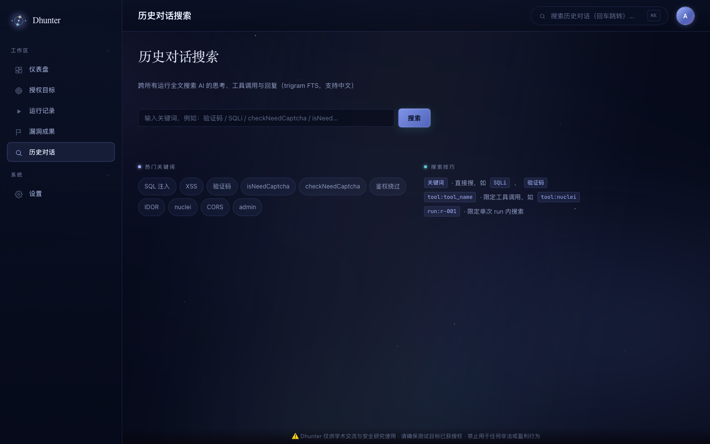

<p align="center">
  
</p>

> ⚠️ **仅供学术交流与安全研究使用 · 禁止用于任何非法或盈利行为。**
> 请确保所有测试目标均已获得授权。

---

## 它不是漏扫，而是一个"手动化"的渗透测试 agent

传统漏扫器只会跑 CVE 指纹和已知 payload。Dhunter 让一个（未来多个）**LLM agent** 驱动一套精选工具，像真人渗透测试员那样思考与行动：

- 先做**侦察**（子域 / JS / 指纹 / 历史 URL），把攻击面摸清；
- 再**规划**攻击意图，一个黑板（blackboard）协调多个 worker **并行探索**；
- 每个结论都要**先验证再上报**——SRC 验收门禁会机械重放你的 PoC，时变噪声会被自动驳回；
- 最终把确认的漏洞汇总成一份 **Markdown 报告**。

## 📸 真实效果

下面这张攻击链图来自一次真实的授权测试（Typecho 博客靶场）：agent 自主构建了 49 条事实、7 个攻击意图，把 `.git` 暴露、XML-RPC SSRF、install.php 等发现串成完整的攻击链。

<p align="center">
  
  <em>攻击链图：agent 自主构建的事实 → 意图 → 发现网络，实时可视化</em>
</p>

平台主界面与核心功能：

<p align="center">
  
  
</p>

<p align="center">
  
  
</p>

<p align="center">
  
  
</p>

## ✨ 核心特性

| 特性 | 说明 |
|---|---|
| 🧠 **黑板引擎** | facts/intents/hints 持久化到 SQLite，planner 提出意图 → 多 worker 并行探索 → 收敛，纯 stigmergy 协调 |
| 🔍 **手动化侦察** | 子域枚举、JS 资产与凭据分析、历史 URL、技术指纹，20+ 内置工具随平台启动 |
| ⚔️ **主动测试** | HTTP 手工探测、参数 fuzz、认证绕过、信息泄露路径、业务逻辑测试，agent 自主选工具 |
| 🛡️ **SRC 验收门禁** | verifier 对每条漏洞做**机械重放 + 稳定性检查**：同一 PoC 两次结果不一致 = 时变噪声 → 自动驳回，杜绝误报 |
| 🎯 **漏洞优先验证** | worker 每落地一条漏洞立即触发 verifier 机械重放验证，不用等扫描结束 |
| 🧵 **每项目并发设置** | 创建目标时可指定并发 worker 数，深挖大目标时加大并发、小目标降速省 token |
| ⏸️ **运行暂停/恢复** | 随时暂停 run（保留已发现的黑板），之后一键「继续」从断点恢复 |
| 📦 **项目一键导出** | 目标卡上「导出报告」一键打包该项目全部漏洞为 Markdown（含 PoC/复现/证据） |
| ⚡ **实时思考流** | SSE 实时推送 agent 的思考、工具调用、工具结果，整个过程透明可见 |
| 📄 **一键报告** | 每次运行导出 Markdown 报告 |
| 🔐 **首启自动账号** | 首次运行自动生成管理账号（用户名 + 随机密码），横幅展示，之后可在设置页修改 |
| 💻 **跨平台** | macOS / Linux / Windows 三平台启动脚本，Go 纯静态二进制（无 CGO） |

## 🚀 快速开始

### 一键启动（推荐）

```bash
# macOS / Linux
./scripts/start-dhunter.sh start

# Windows
powershell -ExecutionPolicy Bypass -File scripts\start-dhunter.ps1 start
```

启动后打开 <http://127.0.0.1:13343/>。

**首次运行的登录账号会自动生成**，在启动横幅（终端 / 日志）中可见：

```
╔════════════════════════════════════════════════════════╗
║                       Dhunter                          ║
╚════════════════════════════════════════════════════════╝
  ONLINE  http://127.0.0.1:13343/
  ADMIN SETUP REQUIRED
    username: admin
    password: <随机生成，仅显示一次>
    token:    <随机生成>
```

登录后可在**设置 → 登录账号**里修改用户名和密码。之后每次重启登录凭据保持不变。

### 使用流程（用户视角）

1. **授权目标** → 新建目标：填目标（公司/域名/URL/IP）、目标说明、可选身份会话与红线，按需设置**并发 worker 数**
2. **启动评估** → 平台自动跑：planner 规划攻击意图 → 多 worker 并行探索 → **每落地一条漏洞立即机械重放验证**
3. **实时跟踪** → 运行详情页看 agent 思考流、工具调用、攻击图；扫到一半可 **⏸ 暂停**，之后 **▶ 继续**
4. **导出报告** → 目标卡「导出报告」一键打包该项目全部漏洞（Markdown，含 PoC/复现/证据）；运行详情也有单次 Markdown 报告

### 手动启动

```bash
# 1. 构建 Go 平台（server + MCP 工具）
go build -o bin/dhunter-server ./cmd/dhunter-server
go build -o bin/dhunter-mcp    ./cmd/dhunter-mcp

# 2. 启动 Python agent（黑板引擎）
cd agents
pip install -r requirements.txt
python -m core.server          # 127.0.0.1:9100

# 3. 启动 server
./bin/dhunter-server --config configs/dhunter.yaml
```

## 🧰 外部工具依赖（可选）

Dhunter **核心服务零外部依赖**（Go 单二进制 + 进程内 HTTP）。外部扫描器是**可选的**——未安装时平台会**自动跳过并提示改用替代方法**（graceful degradation），不影响核心漏洞挖掘。

一键安装全部扫描器：

```bash
# macOS / Linux
./scripts/setup-tools.sh

# Windows
powershell -ExecutionPolicy Bypass -File scripts\setup-tools.ps1
```

安装后二进制落在 `tools/bin/`，启动脚本自动加入 PATH。也可手动安装：

| 工具 | 用途 | macOS | Windows |
|---|---|---|---|
| `httpx` | 存活 / 指纹 / 技术识别 | `go install github.com/projectdiscovery/httpx/cmd/httpx@latest` | 同左（装 Go 后） |
| `subfinder` | 被动子域枚举 | `go install github.com/projectdiscovery/subfinder/v2/cmd/subfinder@latest` | 同左 |
| `katana` | 全站爬虫 | `go install github.com/projectdiscovery/katana/cmd/katana@latest` | 同左 |
| `gau` | 历史 URL | `go install github.com/lc/gau/v2/cmd/gau@latest` | 同左 |
| `waybackurls` | Wayback URL | `go install github.com/tomnomnom/waybackurls@latest` | 同左 |
| `assetfinder` | 子域发现 | `go install github.com/tomnomnom/assetfinder@latest` | 同左 |
| `nmap` | 端口扫描 | `brew install nmap` | [官方安装包](https://nmap.org/download.html) |
| `arjun` / `uro` | 参数 fuzz / URL 去重 | `pip3 install arjun uro` | `pip install arjun uro` |

> 缺少某个扫描器不会报错——agent 会收到"[工具 xxx 未安装] 已跳过，可改用替代方法"的提示并自动换工具。

### 配置 LLM

Dhunter 兼容 Anthropic / OpenAI 协议（DeepSeek / MiniMax / Qwen / GLM / Claude…）。在**设置页**填入模型、Base URL、API Key 并测试连接，或在 `configs/dhunter.yaml` 配置：

```yaml
llm:
  provider: anthropic
  model: "deepseek-chat"
  base_url: "https://api.deepseek.com/anthropic"
  api_key: "sk-..."
```

## 🏗 架构

```
┌────────────────┐     ┌────────────────┐     ┌─────────────────┐
│  Vue 3 Web UI  │ ←─→ │ Go HTTP + SSE  │ ←─→ │ Python Agent    │
│  (Vite build)  │     │  (Gin)         │     │ (黑板 + worker) │
└────────────────┘     └────────────────┘     └────────┬────────┘
                              │                        │
                              ↓                        ↓
                       ┌────────────┐         ┌──────────────┐
                       │  SQLite    │         │  MCP 工具集  │
                       │ targets /  │         │  侦察 / 指纹  │
                       │ runs /     │         │  主动测试     │
                       │ vulns /    │         │  报告         │
                       └────────────┘         └──────────────┘
```

**运行流程**：`origin/goal 事实` 种入黑板 → planner（reason）提出攻击意图 → 多 worker 并行探索并回写事实 → 收敛 → verifier 对每条漏洞做机械重放验收 → 生成报告。worker 之间不直接通信，全靠黑板协调（stigmergy）。

## ⚙️ 配置

| Key | 默认值 | 说明 |
|---|---|---|
| `server.port` | `13343` | HTTP 端口 |
| `agent.python_url` | `http://127.0.0.1:9100` | Python agent |
| `mcp.webhunter.url` | `http://127.0.0.1:9124/message` | MCP 工具端点 |
| `llm.provider` | `anthropic` | `anthropic` / `openai` |
| `storage.sqlite_path` | `../data/dhunter.db` | 相对配置文件解析，跨平台 |
| `admin.username` | `admin` | 登录用户名（首启可改） |
| `admin.bootstrap_password` | 空 | 首次启动初始密码；留空则随机生成。改密码请用设置页 |

环境变量：`DHUNTER_PORT` / `DHUNTER_SQLITE_PATH` / `DHUNTER_LLM_API_KEY` / `DHUNTER_ADMIN_TOKEN` 等均可覆盖 YAML。

## 🔧 常用命令

```bash
./scripts/start-dhunter.sh status   # 查看三件套状态
./scripts/start-dhunter.sh stop     # 停止
./scripts/start-dhunter.sh logs     # 跟踪日志
```

## ⚠️ 免责声明

**Dhunter 是一个安全研究与教育培训工具。**

- 仅供学术交流、安全研究与技术讨论使用；
- **严禁用于任何非法活动、未授权测试或盈利行为**；
- 使用者必须确保所有测试目标已获得明确授权；
- 使用者应对自身行为及其后果承担全部责任，作者不对任何滥用行为负责。

详见 [LICENSE](LICENSE)。

## 📜 License

[非商业学术许可（Non-Commercial Academic License）](LICENSE) — 允许学术交流与安全研究使用，禁止任何商业与盈利行为。

---

<p align="center"><sub>Dhunter · 仅供学术交流与安全研究 · 请勿用于非法或盈利用途</sub></p>
