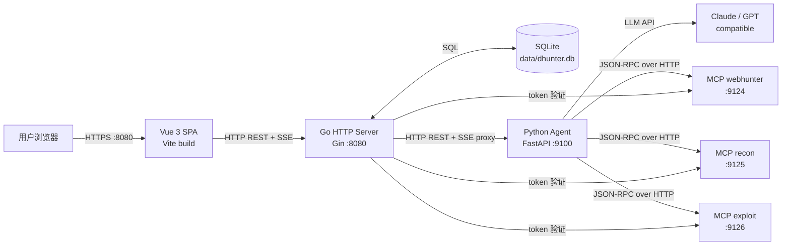
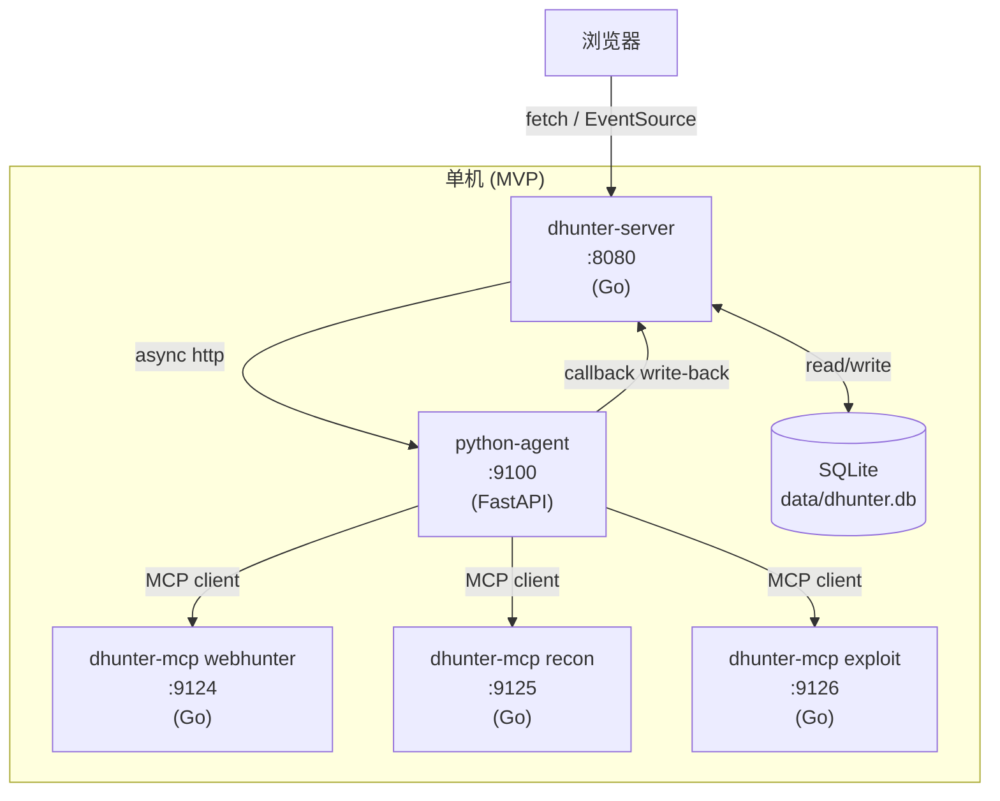
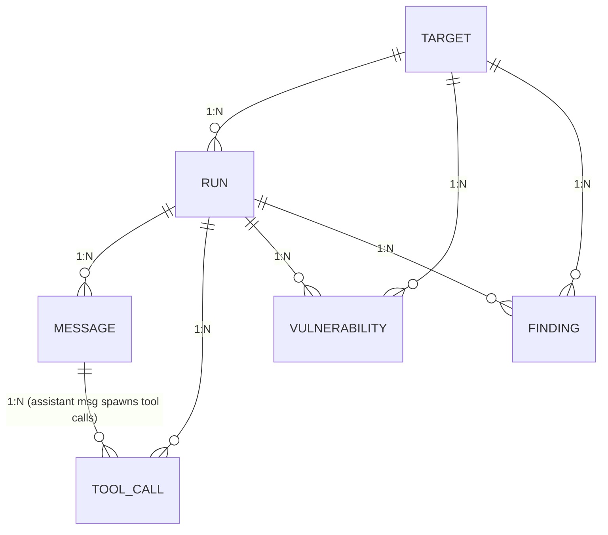
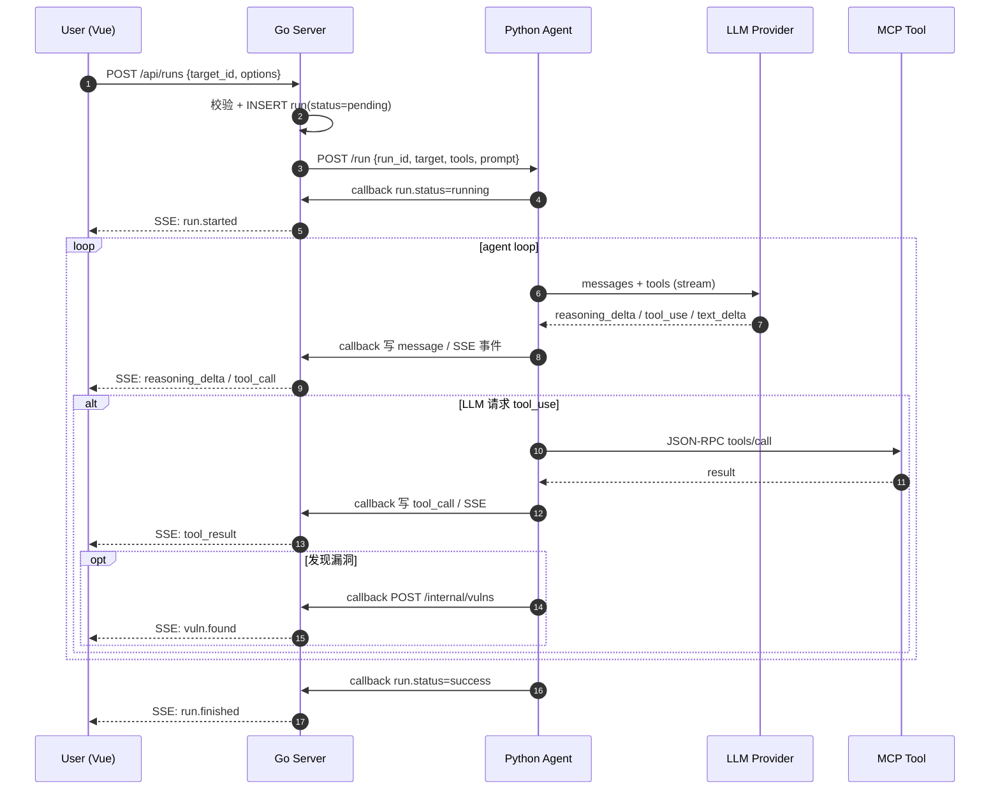
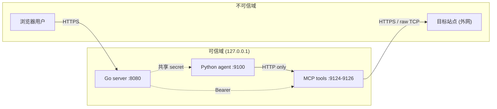

# Dhunter 架构文档 (MVP)

> 版本: v0.1 (MVP 端到端单闭环)
> 范围: 目标输入 → AI 主动测试 → 漏洞入库 → 报告导出
> 状态: 实施中,本文档为后续编码的契约基线

---

## 1. 概述

Dhunter 是一个 **AI 驱动的 web 渗透测试平台**:用户输入一个目标(公司名 / 域名 / URL / IP),由 LLM agent 主动调用工具完成侦察、探测、漏洞验证,并将结果以可读报告形式输出。它**不是**漏扫,核心价值在于「agent 推理 + 工具带」的智能编排能力。

### 1.1 MVP 范围(必做)

- 目标解析(公司名 / 域名 / URL / IP → 归一化 Target)
- Python single-agent 调用 LLM + MCP 工具
- SSE 实时推送 AI 思考流(reasoning / tool_call / response_delta)
- 漏洞入库(SQLite,FK 关联 Target / Run)
- 一键 Markdown 报告导出

### 1.2 非目标(post-MVP)

攻击链路图、报告模板、多 Agent 并行、多租户 / RBAC、远程协作。

### 1.3 技术栈

| 层 | 技术 |
|---|---|
| Go 后端 | Go 1.22 + Gin + sqlx + golang-migrate |
| Python agent | Python 3.11 + FastAPI + httpx + pydantic v2 |
| 前端 | Vue 3 + Vite + Pinia + Naive UI |
| 数据 | SQLite (WAL) + 内存 SSE Hub |
| 协议 | HTTP REST + SSE + JSON-RPC 2.0 (streamable-HTTP MCP) |

---

## 2. 总体架构图

### 2.1 部署视图



### 2.2 进程拓扑



---

## 3. 模块划分

四层:Go 后端 / Python agent / Vue 前端 / MCP tools。

### 3.1 Go 后端(`cmd/dhunter-server` + `internal/*`)

职责:**编排层 + 持久化 + 流式转发**。不直接做 LLM 推理。

| 包 | 职责 |
|---|---|
| `internal/app` | 进程启动、依赖装配、优雅退出 |
| `internal/config` | 读 `configs/config.yaml` + 环境变量覆盖 |
| `internal/db` | sqlite 初始化、migrations、连接池(WAL) |
| `internal/handler` | HTTP handler:target / run / vuln / report / sse |
| `internal/middleware` | auth / recovery / access log / 限流 |
| `internal/target` | 目标解析(公司名 → 域名启发式) |
| `internal/store` | Repository:CRUD + 事务 |
| `internal/stream` | SSE Hub:订阅/广播、断线缓冲 |
| `internal/report` | Markdown 报告渲染(模板 + 聚合) |
| `internal/lic` | license 校验(预留) |

### 3.2 Python agent(`agents/*`)

职责:**LLM 推理 + 工具调用编排 + 思考流生成**。

| 包 | 职责 |
|---|---|
| `agents/core/server.py` | FastAPI 入口:`POST /run`,`POST /run/{id}/cancel`,`GET /healthz` |
| `agents/core/loop.py` | agent 主循环:LLM 推理 → 工具调用 → 写回 |
| `agents/core/callback.py` | 事件以 HTTP POST 写回 Go |
| `agents/llm/client.py` | LLM 客户端抽象(anthropic / openai_compatible) |
| `agents/llm/stream.py` | 流式响应解析 → 统一事件 |
| `agents/tools/mcp_client.py` | JSON-RPC over HTTP MCP 客户端 |
| `agents/tools/router.py` | 工具路由 + 重试 + 超时 |
| `agents/prompts/*.md` | system / target 模板 |

### 3.3 Vue 前端(`frontend/src/*`)

| 目录 | 职责 |
|---|---|
| `src/views/TargetInput.vue` | 目标输入、Run 启动 |
| `src/views/RunDetail.vue` | 实时流:思考 / 工具调用 / 漏洞卡片 |
| `src/views/VulnList.vue` | 历史漏洞列表 / 筛选 |
| `src/views/Report.vue` | 报告预览 + 下载 |
| `src/stores/run.ts` | Pinia:当前 run、SSE 状态 |
| `src/api/*` | REST client + EventSource 封装 |

### 3.4 MCP tools(`cmd/dhunter-mcp/*` + `internal/mcp/*`)

独立 Go 进程,每工具一个 MCP server,streamable-HTTP 协议(`POST /message`,JSON-RPC 2.0)。

| 工具 | 能力 |
|---|---|
| `webhunter` | HTTP 探测、参数 fuzzing、认证绕过、信息泄露路径 |
| `recon` | 子域名枚举、端口扫描、whois、证书透明日志 |
| `exploit` | 漏洞验证 PoC、payload 投递、结果判定 |

---

## 4. 数据模型

存储引擎:SQLite 3.45+ (WAL 模式,`synchronous=NORMAL`,`busy_timeout=5000`)。

迁移管理:`migrations/` 目录,序号化 `0001_init.sql` ... 顺序执行。
所有 ID 类型以 `INTEGER`/`TEXT` 表达,JSON 字段以 `TEXT` 存序列化字符串。

### 4.1 关系总览



### 4.2 `target` — 目标表

归一化后的目标,一输入可解析出一条记录。

| 字段 | Go 类型 | SQL 类型 | 约束 / 说明 |
|---|---|---|---|
| `id` | `int64` | `INTEGER PRIMARY KEY AUTOINCREMENT` | |
| `raw_input` | `string` | `TEXT NOT NULL` | 用户原始输入 |
| `input_type` | `string` | `TEXT NOT NULL` | `company` / `domain` / `url` / `ip` |
| `normalized` | `string` | `TEXT NOT NULL` | 归一化后主标识(根域名或 IP) |
| `root_domain` | `string` | `TEXT` | 根域名(从 URL/domain 抽取) |
| `company_name` | `string` | `TEXT` | 解析出的公司名(若可得) |
| `ips_json` | `string` | `TEXT` | JSON 数组,关联 IP 列表 |
| `urls_json` | `string` | `TEXT` | JSON 数组,关联 URL 列表 |
| `metadata_json` | `string` | `TEXT` | 其他上下文(JSON) |
| `created_at` | `time.Time` | `INTEGER NOT NULL` | unix 秒 |
| `updated_at` | `time.Time` | `INTEGER NOT NULL` | unix 秒 |

索引:`UNIQUE(input_type, normalized)`、`INDEX(created_at)`。

```python
@dataclass
class Target:
    id: int
    raw_input: str
    input_type: Literal["company", "domain", "url", "ip"]
    normalized: str
    root_domain: Optional[str] = None
    company_name: Optional[str] = None
    ips: list[str] = field(default_factory=list)
    urls: list[str] = field(default_factory=list)
    metadata: dict[str, Any] = field(default_factory=dict)
```

### 4.3 `run` — 测试运行表

| 字段 | Go 类型 | SQL 类型 | 约束 / 说明 |
|---|---|---|---|
| `id` | `string` (uuid) | `TEXT PRIMARY KEY` | 前端用,友好字符串 |
| `target_id` | `int64` | `INTEGER NOT NULL` | FK → target(id) |
| `status` | `string` | `TEXT NOT NULL` | `pending` / `running` / `success` / `failed` / `cancelled` |
| `llm_model` | `string` | `TEXT NOT NULL` | 实际使用的模型 |
| `started_at` | `*time.Time` | `INTEGER` | |
| `finished_at` | `*time.Time` | `INTEGER` | |
| `duration_ms` | `int64` | `INTEGER NOT NULL DEFAULT 0` | |
| `stats_json` | `string` | `TEXT NOT NULL DEFAULT '{}'` | `{messages, tool_calls, vulns, findings}` |
| `error_msg` | `string` | `TEXT` | 失败原因 |
| `created_at` | `time.Time` | `INTEGER NOT NULL` | |
| `updated_at` | `time.Time` | `INTEGER NOT NULL` | |

索引:`INDEX(target_id, created_at DESC)`、`INDEX(status, created_at DESC)`。

```python
class RunStatus(str, Enum):
    PENDING = "pending"
    RUNNING = "running"
    SUCCESS = "success"
    FAILED = "failed"
    CANCELLED = "cancelled"
```

### 4.4 `message` — 消息表

agent loop 中每条 LLM 输入 / 输出都入库,支持回放。

| 字段 | Go 类型 | SQL 类型 | 约束 / 说明 |
|---|---|---|---|
| `id` | `int64` | `INTEGER PRIMARY KEY AUTOINCREMENT` | |
| `run_id` | `string` | `TEXT NOT NULL` | FK → run(id),ON DELETE CASCADE |
| `seq` | `int` | `INTEGER NOT NULL` | run 内序号,从 0 起 |
| `role` | `string` | `TEXT NOT NULL` | `system` / `user` / `assistant` / `tool` |
| `content` | `string` | `TEXT` | 文本内容(assistant 增量最终聚合) |
| `reasoning` | `string` | `TEXT` | 思考过程(单独列,便于前端折叠) |
| `created_at` | `time.Time` | `INTEGER NOT NULL` | |

索引:`UNIQUE(run_id, seq)`、`INDEX(run_id, created_at)`。

### 4.5 `tool_call` — 工具调用表

| 字段 | Go 类型 | SQL 类型 | 约束 / 说明 |
|---|---|---|---|
| `id` | `string` (uuid) | `TEXT PRIMARY KEY` | LLM 给出的 id,用于关联 |
| `run_id` | `string` | `TEXT NOT NULL` | FK → run(id) |
| `message_id` | `int64` | `INTEGER` | FK → message(id),assistant 消息 |
| `tool_name` | `string` | `TEXT NOT NULL` | e.g. `webhunter.fuzz_param` |
| `arguments_json` | `string` | `TEXT NOT NULL` | 入参 JSON |
| `result_json` | `string` | `TEXT` | 出参 JSON(可为空) |
| `status` | `string` | `TEXT NOT NULL` | `pending` / `ok` / `error` / `timeout` |
| `duration_ms` | `int64` | `INTEGER NOT NULL DEFAULT 0` | |
| `error_msg` | `string` | `TEXT` | |
| `started_at` | `time.Time` | `INTEGER NOT NULL` | |
| `finished_at` | `*time.Time` | `INTEGER` | |

索引:`INDEX(run_id, started_at)`、`INDEX(tool_name, status)`。

### 4.6 `vulnerability` — 漏洞表

| 字段 | Go 类型 | SQL 类型 | 约束 / 说明 |
|---|---|---|---|
| `id` | `int64` | `INTEGER PRIMARY KEY AUTOINCREMENT` | |
| `run_id` | `string` | `TEXT NOT NULL` | FK → run(id) |
| `target_id` | `int64` | `INTEGER NOT NULL` | FK → target(id) |
| `tool_call_id` | `string` | `TEXT` | 触发的工具调用 |
| `title` | `string` | `TEXT NOT NULL` | 一句话描述 |
| `severity` | `string` | `TEXT NOT NULL` | `info` / `low` / `medium` / `high` / `critical` |
| `category` | `string` | `TEXT NOT NULL` | `sqli` / `xss` / `ssrf` / `idoc` / ... |
| `url` | `string` | `TEXT` | 受影响 URL |
| `param` | `string` | `TEXT` | 受影响参数 |
| `evidence` | `string` | `TEXT` | 证据(响应片段等) |
| `poc` | `string` | `TEXT` | 验证 payload |
| `status` | `string` | `TEXT NOT NULL` | `open` / `confirmed` / `closed` / `false_positive` |
| `created_at` | `time.Time` | `INTEGER NOT NULL` | |

索引:`INDEX(target_id, severity)`、`INDEX(run_id, severity)`、`INDEX(category)`。

```python
class VulnSeverity(str, Enum):
    INFO = "info"
    LOW = "low"
    MEDIUM = "medium"
    HIGH = "high"
    CRITICAL = "critical"
```

### 4.7 `finding` — 发现物表

漏洞之外的"素材":子域名、端口、目录、JS 文件、泄漏的密钥等。

| 字段 | Go 类型 | SQL 类型 | 约束 / 说明 |
|---|---|---|---|
| `id` | `int64` | `INTEGER PRIMARY KEY AUTOINCREMENT` | |
| `run_id` | `string` | `TEXT NOT NULL` | FK |
| `target_id` | `int64` | `INTEGER NOT NULL` | FK |
| `kind` | `string` | `TEXT NOT NULL` | `subdomain` / `endpoint` / `port` / `asset` / `credential` / `leak` |
| `value` | `string` | `TEXT NOT NULL` | 主值 |
| `meta_json` | `string` | `TEXT` | 上下文(端口号、HTTP 状态、标题等) |
| `source_tool` | `string` | `TEXT` | e.g. `recon.subdomain_enum` |
| `first_seen_at` | `time.Time` | `INTEGER NOT NULL` | |
| `last_seen_at` | `time.Time` | `INTEGER NOT NULL` | |

索引:`INDEX(target_id, kind)`、`UNIQUE(target_id, kind, value)`。

---

## 5. 关键流程

### 5.1 目标输入 → Target 解析

#### 5.1.1 解析流程图

```mermaid
flowchart TD
    A[用户输入 raw_input] --> B{类型识别}
    B -->|匹配 /^(\d{1,3}\.){3}\d{1,3}$/| C1[type=ip]
    B -->|匹配 ^https?://| C2[type=url]
    B -->|匹配 ^[\w-]+(\.[\w-]+)+$| C3[type=domain]
    B -->|其余| C4[type=company]
    C1 --> D[normalized=ip<br/>root_domain=null]
    C2 --> E[url.Parse → host<br/>提取 scheme/host/path]
    C3 --> F[domain 归一化小写去 www]
    C4 --> G[company 启发式:<br/>后缀替换 + 公开搜索]
    E --> H[url → 关联 domain]
    F --> H
    G --> H
    H --> I[目标存在?<br/>查询 DB 复用]
    I -->|存在| J[返回 existing target]
    I -->|不存在| K[INSERT target<br/>返回 id]
    K --> L[返回 new target]
```

#### 5.1.2 类型识别算法(`internal/target/parser.go`)

```text
1. trim 空格,toLower
2. 优先匹配 ^https?://        → 走 URL 解析
3. 否则匹配 IPv4 正则          → type=ip
4. 否则匹配域名正则(含 .)      → type=domain
5. 兜底为 company

URL: url.Parse → stripPort → etld+1(golang.org/x/publicsuffix) → root_domain
Domain: etld+1 → root_domain
Company(MVP 占位): raw → normalized,v1.1+ 接 LLM 猜根域
```

#### 5.1.3 唯一性

`target` 表 `(input_type, normalized)` 唯一索引,重复输入直接复用。

### 5.2 Run 启动 → Agent 循环 → 漏洞发现

#### 5.2.1 总体时序



#### 5.2.2 Agent 主循环(`agents/core/loop.py`)

```text
inputs:  run_id, target, history, tools, max_steps=50
outputs: 写回 run / message / tool_call / vuln / finding

while step < max_steps and not stop_signal:
    1. messages = serialize(history)
    2. stream = LLM.chat(messages, tools=tools)  # 流式
    3. 解析流,累加 reasoning / text / tool_use
       每个 delta 实时回调(reasoning_delta / response_delta)
    4. 完整 assistant message 写库(seq=next)
    5. if tool_use:
         for call in tool_uses:
           写 tool_call(pending) + 回调 started
           try:   result = mcp.call(name, args, timeout=30s)
           except: status = error/timeout
           写 result + 回调 finished
           推 role=tool message(tool_use_id + result)
           若 result.vuln: POST /internal/vulns
           若 result.kind ∈ {asset,leak}: POST /internal/findings
       else:
         break  # LLM 主动收尾
    6. step += 1
end
收尾: run.status = success / failed, 回调写库
```

> 漏洞信号由工具返回的结构化字段触发,不依赖 LLM 二次判断,降低延迟与幻觉。

### 5.3 SSE 事件流

#### 5.3.1 通道

每个 run 一个独立 SSE channel,路径 `GET /api/runs/{run_id}/sse`。
Header:`Content-Type: text/event-stream`、`Cache-Control: no-cache`、`X-Accel-Buffering: no`。
心跳:`event: ping\ndata: {"ts":...}\n\n` 每 15s 一次(可配)。

#### 5.3.2 事件类型

所有事件统一 envelope:

```json
{ "type": "<event_type>", "ts": 1737012345, "data": { ... } }
```

| `type` | 触发时机 | data 关键字段 |
|---|---|---|
| `run.started` | run 进入 running | `run_id`, `model` |
| `run.finished` | run 终态 | `run_id`, `status`, `duration_ms`, `stats` |
| `run.error` | run 异常终止 | `run_id`, `error` |
| `message.start` | 新 message 开始 | `message_id`, `role` |
| `message.end` | message 完整入库 | `message_id`, `seq` |
| `reasoning_delta` | LLM 思考流 | `message_id`, `delta` |
| `response_delta` | LLM 文本流 | `message_id`, `delta` |
| `tool_call.started` | 工具调用发起 | `tool_call_id`, `name`, `arguments` |
| `tool_call.finished` | 工具调用返回 | `tool_call_id`, `status`, `result`, `duration_ms` |
| `vuln.found` | 漏洞入库 | `vuln` 完整对象 |
| `finding.found` | 发现物入库 | `finding` 完整对象 |
| `ping` | 心跳 | `ts` |

#### 5.3.3 Go 侧 Hub(`internal/stream/hub.go`)

```text
Hub:
  - subscribers: map[run_id][]chan envelope  // 写缓冲 32
  - 写事件: Hub.Publish(run_id, env) → fanout
  - 订阅: Hub.Subscribe(run_id) → (chan, unsubscribe)
  - 背压: 订阅方 chan 满则丢最早 + 记日志
  - 重连: 客户端用 Last-Event-ID 重放(实现上通过 seq 字段)
```

#### 5.3.4 Python → Go 写回

Python 不直连 SSE,通过 `POST /internal/events` 写回 Go,Go 落库后由 Hub 广播。Go 异步批写(每 100ms 或 20 条 flush 一次)以降低 DB 压力。请求体同 envelope 数组,Header `X-Dhunter-Internal-Token: <shared>`。

---

## 6. 接口契约

### 6.1 Go ↔ Python (REST + 写回)

#### 6.1.1 Go → Python

`POST /run`(Python 端)

```json
// request
{
  "run_id": "uuid",
  "target": { /* Target */ },
  "options": { "model": "claude-sonnet-4-5", "max_steps": 50,
               "tools_allowlist": ["webhunter.*", "recon.*", "exploit.*"] },
  "system_prompt": "...",
  "callback_url": "http://127.0.0.1:8080/internal/events",
  "callback_token": "<shared>"
}
// 202 Accepted
{ "accepted": true, "run_id": "uuid" }
```

`POST /run/{run_id}/cancel` → `{ "cancelled": true, "stopped_step": 12 }`
`GET /healthz` → `{ "ok": true, "uptime_seconds": 3600, "active_runs": 2 }`

> MVP 阶段 SSE 全部由 Go 持有,Python 仅通过 `callback_url` 写回,避免双向 SSE 复杂度。

#### 6.1.2 Python → Go 写回

`POST /internal/events`(Go 侧,共享 secret 鉴权)

```json
{ "run_id": "uuid",
  "events": [ {"type":"run.started","ts":1737,"data":{...}}, ... ] }
```

`POST /internal/vulns`(Go 侧)

```json
{ "run_id":"uuid", "target_id":42, "tool_call_id":"uuid",
  "vuln": { "title":"SQLi in search", "severity":"high", "category":"sqli",
            "url":"https://x/search", "param":"q",
            "evidence":"...", "poc":"' OR 1=1-- -", "status":"confirmed" } }
```

`POST /internal/findings` 结构同上,`vuln` 字段名换为 `finding`。

#### 6.1.3 Go 对外 REST(供前端)

| Method | Path | 用途 |
|---|---|---|
| `POST` | `/api/targets` | 创建 target(去重) |
| `GET` | `/api/targets` / `/api/targets/{id}` | 列表 / 详情 |
| `POST` | `/api/runs` | 启动 run |
| `GET` | `/api/runs` / `/api/runs/{id}` | 列表 / 详情 |
| `GET` | `/api/runs/{id}/sse` | **SSE 实时流** |
| `POST` | `/api/runs/{id}/cancel` | 取消 |
| `GET` | `/api/runs/{id}/report.md` | 下载 Markdown 报告 |
| `GET` | `/api/runs/{id}/vulns` | 漏洞列表 |
| `GET` | `/api/runs/{id}/findings` | 发现物列表 |
| `GET` | `/api/vulns` | 跨 run 漏洞列表 |

错误格式统一:`{ "error": { "code":"TARGET_INVALID", "message":"...", "detail":{...} } }`

### 6.2 Python ↔ MCP(JSON-RPC 2.0 over HTTP)

streamable-HTTP:每个请求 `POST /message`,Header `Authorization: Bearer <mcp token>`,Body JSON-RPC 2.0。

#### 6.2.1 工具发现 / 调用

```json
// tools/list
{ "jsonrpc":"2.0","id":"1","method":"tools/list","params":{} }
// → { "result": { "tools": [{ "name":"webhunter.fuzz_param",
//                              "inputSchema": {...} }] } }

// tools/call
{ "jsonrpc":"2.0","id":"abc","method":"tools/call",
  "params": { "name":"webhunter.fuzz_param",
              "arguments":{ "url":"https://x/api", "param":"id",
                            "payloads":["sqli-basic"] } } }
// → { "result": { "content":[{"type":"json","data":{"vuln":{...}}}], "isError":false } }
```

#### 6.2.2 错误码

| code | 含义 | agent 处理 |
|---|---|---|
| `-32700` / `-32600` | Parse / Invalid request | 立即终止 run,failed |
| `-32601` | Method not found | 跳过该 tool_call,继续 |
| `-32602` | Invalid params | 写 error_msg,跳过 |
| `-32603` | Internal error | 重试 1 次,仍失败标 timeout |
| `-32001` / `-32002` | 工具自定义:网络/超时 | 标 timeout |

超时:Python `httpx` 30s,MCP 内部单步 25s 留 5s 余量。

### 6.3 版本与兼容

- REST 路径前缀 `/api/v1/` 预留(MVP 用 `/api/`,v1 切换时再迁移)
- 事件 `type` 字符串为稳定契约,新增字段向前兼容
- MCP tools schema 维护在 `internal/mcp/<tool>/<version>/schema.json`

---

## 7. 部署

### 7.1 单机启动顺序

```text
[1] 初始化 data 目录,migrations apply
    ./bin/dhunter-server --init-db

[2] 启动 MCP 工具进程(后台,顺序无关)
    ./bin/dhunter-mcp webhunter --port 9124 --token <tok1> &
    ./bin/dhunter-mcp recon     --port 9125 --token <tok2> &
    ./bin/dhunter-mcp exploit   --port 9126 --token <tok3> &

[3] 启动 Python agent(等 MCP 起来)
    cd agents && source .venv/bin/activate
    python -m core.server --port 9100 &

[4] 启动 Go HTTP server(等 Python 起来)
    ./bin/dhunter-server --port 8080 --config configs/config.yaml

[5] 前端 dev(Vite) 或 静态文件托管
    cd frontend && npm run dev   # http://127.0.0.1:5173,代理 /api → 8080
    # 生产: vite build 产物由 Go embed,无需独立进程
```

一键脚本:`./scripts/run-dev.sh` 完成 [1]~[4];前端独立 `npm run dev` 调试。

### 7.2 端口分配

| 端口 | 进程 | 用途 |
|---|---|---|
| `8080` | dhunter-server | 对外 HTTP+SSE(也提供前端静态资源) |
| `9100` | python-agent | 内部 REST(MVP 仅本机) |
| `9124` | dhunter-mcp webhunter | streamable-HTTP MCP |
| `9125` | dhunter-mcp recon | streamable-HTTP MCP |
| `9126` | dhunter-mcp exploit | streamable-HTTP MCP |
| `5173` | vite dev | 前端 dev only(生产由 8080 服务) |

所有内部端口 bind `127.0.0.1`;只有 `8080` 对外暴露。

### 7.3 配置文件(`configs/config.yaml`)

```yaml
server:
  port: 8080
  sse_keepalive_seconds: 15

agent:
  python_url: http://127.0.0.1:9100
  internal_token: ${DHUNTER_INTERNAL_TOKEN}     # 共享 secret
  callback_timeout_seconds: 10
  callback_batch_ms: 100
  callback_batch_size: 20

mcp:
  webhunter:
    url: http://127.0.0.1:9124/message
    token: ${DHUNTER_MCP_WEBHUNTER_TOKEN}
  recon:
    url: http://127.0.0.1:9125/message
    token: ${DHUNTER_MCP_RECON_TOKEN}
  exploit:
    url: http://127.0.0.1:9126/message
    token: ${DHUNTER_MCP_EXPLOIT_TOKEN}

llm:
  provider: anthropic          # anthropic / openai_compatible
  model: claude-sonnet-4-5
  api_key: ${DHUNTER_LLM_KEY}
  max_tokens: 8192
  temperature: 0.2

storage:
  sqlite_path: ./data/dhunter.db
  wal: true
```

### 7.4 优雅退出

监听 `SIGTERM` / `SIGINT`:

1. Go:停止接新请求 → 等所有 SSE 连接 drain(最长 5s)→ 关闭 DB
2. Python:停止派发新 tool_call → 等待当前 LLM 响应结束 → 写回残余事件
3. MCP:接受 5s 内的 cancel → 退出

---

## 8. 安全 / 隔离

### 8.1 信任域



`127.0.0.1` 内部端口不暴露外网,Python / MCP 不接受非本机连接。

### 8.2 工具沙箱(MCP 进程级)

每个 MCP 工具独立 Go 进程,默认安全配置:

| 维度 | 措施 |
|---|---|
| 网络出站 | 工具只能走 HTTPS / 必要端口(80, 443, 8443);白名单目标 host(MVP:任意,MVP 后置白名单) |
| 网络入站 | 仅监听 `127.0.0.1`,需 Bearer token |
| 资源 | 单工具 `GOGC=20`,单请求超时 30s,单 run 并发 ≤ 4 |
| 危险动作 | `system` / `os` 类 payload 在工具层 `allowlist` 拒绝(MVP 仅 webhunter,风险低) |
| 日志 | 所有 tool_call 入库,可审计 |
| 进程隔离 | 一个工具崩溃不影响其他工具或主进程 |

### 8.3 LLM 凭据存储

- API key **永不落库**,仅读自环境变量 `DHUNTER_LLM_KEY`
- 配置文件中以 `${DHUNTER_LLM_KEY}` 占位,启动时注入
- Go 进程内存中持有,日志输出需 `redact`(`internal/middleware/redact.go`)
- 部署文档要求使用 secret manager 或受限环境变量,不进 git

### 8.4 速率限制

| 路径 | 限制 |
|---|---|
| 前端 → Go | 同 IP 60 req/min(IP+path 维度) |
| Go → Python | 单 run ≤ 50 回调/秒,超出合并 |
| Python → MCP | 单 run in-flight ≤ 4,队列 ≤ 16 |
| Python → LLM | 单 run 累计 token ≤ 1M;超限 `status=success, partial=true` |
| MCP → 目标站 | 单 host 并发 ≤ 4,QPS ≤ 10(防封禁) |

超限返回 `429`;事件层降级不丢关键事件(`tool_call.finished` / `vuln.found`)。

### 8.5 输入验证

- 用户输入:长度 ≤ 1024,`internal/middleware/validator.go` 拒绝明显注入
- 工具 `arguments`:MCP 端按 `inputSchema` 校验,拒绝对 `127.0.0.0/8`、`169.254.0.0/16`、`metadata.google.internal` 等 SSRF 目标(MVP 简化;v1.1 接 allowlist)
- LLM 输出:不直接当代码执行,仅解析 `tool_use` 字段

### 8.6 审计

- `run` / `message` / `tool_call` / `vulnerability` / `finding` 写入即留痕
- 报告导出记录 `report.exported` 事件(预留表,MVP 可仅日志)
- License 校验调用留日志(`internal/lic`)

---

## 9. 测试策略

### 9.1 单元测试

| 层 | 范围 | 工具 |
|---|---|---|
| Go | target parser、store CRUD、Hub、report 渲染 | `go test` + `testify` + `sqlmock` |
| Python | LLM 流解析、tool router、vuln 信号提取、loop 状态机 | `pytest` + `pytest-asyncio` + `respx`(httpx mock) |
| Vue | 组件渲染、Pinia store | `vitest` + `@vue/test-utils` |
| MCP | 各工具核心逻辑(网络层 mock) | `go test` + `httptest` |

覆盖率门槛:核心模块 ≥ 70%,目标 parser / 报告渲染 ≥ 90%。

### 9.2 集成测试

不依赖真实外网,**全部走 mock**:

- Go 启动测试 SQLite + HTTP,跑通 target → run → vuln → report
- Python 启动测试 FastAPI,用 mock LLM 返回固定流,用 mock MCP 返回固定 result
- 全链路:`pytest tests/integration/test_e2e_loop.py` 启两个进程,跑完一个 3 step 假 run,断言 DB 行数与 SSE 事件序列

### 9.3 E2E smoke

`tests/e2e/smoke_test.sh` / `Makefile e2e`:

```text
[1] 启 SQLite(memory)+migrations
[2] 启 mock LLM(:9099)+ mock MCP(:9199)+ Python(:9100)+ Go(:8080)
[3] curl POST /api/targets {raw_input: "https://example.com"}
[4] curl POST /api/runs   {target_id: 1}
[5] curl -N /api/runs/{id}/sse  收集并断言:
    - 包含 run.started / run.finished
    - 至少一次 reasoning_delta
    - 至少一次 tool_call.started + tool_call.finished
[6] 断言 vulnerability 表 ≥1 行,report.md 非空且含漏洞标题
[7] 关闭所有进程,exit 0
```

CI:每次 PR 跑 smoke;夜间跑完整集成(不含真实 LLM)。

### 9.4 安全测试

- OWASP API Top 10:Go handler 输入验证、auth、SSE 注入
- SSRF:工具层对 `127.0.0.0/8` 等目标拒绝(MVP 简化)
- 越权:单租户无 IDOR,预留接口签名

### 9.5 性能基线(可选,MVP 末做)

5 个 run 并发(每 run 50 step),CPU < 2 核,内存 < 4GB,SSE 端到端延迟 P95 < 800ms。

---

## 10. 决策记录(摘要)

| # | 决策 | 原因 |
|---|---|---|
| D1 | 工具调用走 streamable-HTTP MCP(非 stdio) | 跨进程隔离,Go 也能直接调;stdio 难以被 Go 复用 |
| D2 | SSE 由 Go 持有,Python 通过 callback 写回 | 避免双向 SSE 复杂度;Go 统一鉴权、限流、广播 |
| D3 | SQLite 而非 Postgres | MVP 单机,零运维;FK + WAL 足够 |
| D4 | 单一 Go 二进制 embed 前端 | 用户侧无 Node 依赖;MVP 体验优先 |
| D5 | 漏洞信号由工具结果结构化字段触发,而非 LLM 二次判断 | 降低延迟、避免幻觉,LLM 仅在收尾 review |
| D6 | LLM 凭据走环境变量,不入库、不入配置文件 | 合规、轮换方便 |
| D7 | Python 用 venv + pip,而非 uv / poetry | 与现有运维习惯一致,降低接手门槛 |

---

## 11. 待办 / 开放问题

- [ ] Company → 根域:MVP 占位,v1.1 接 LLM 或公开数据
- [ ] 工具白名单:MVP 全开,v1.1 allowlist
- [ ] 攻击链路图:v1.2,需为 finding 加 `parent_id`
- [ ] 报告模板:Markdown → .docx
- [ ] 多 Agent 并行:loop 抽象为 worker 池
- [ ] 报告附图:base64 截图转存

> 本文档为实施契约基线。任何与本文档不一致的代码修改,需先 PR 文档、再改代码。
